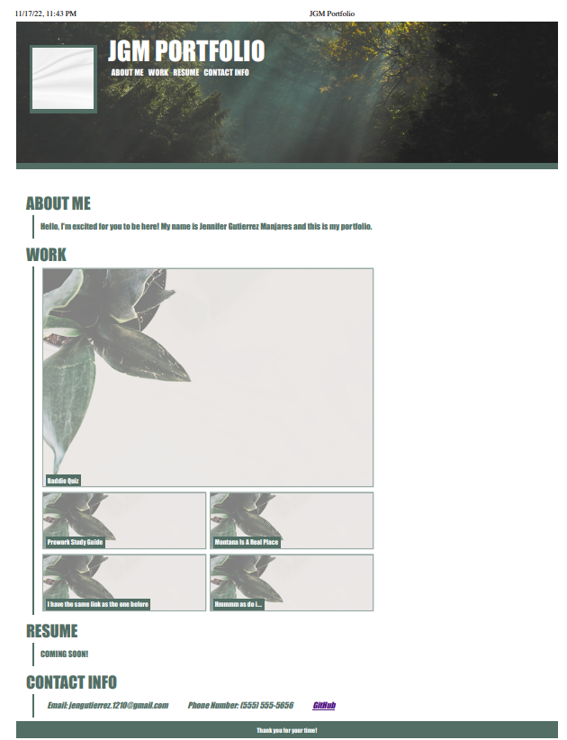

# Challenge2

## Description

This challenge was focused on variouuuss thhings but for the most part it consisted of applying what we've learned in this bootcamp in CSS, HTML, and a little bit of javascript while also applying best practices to keep everything adaptable to different viewports. Overall this project is the beginning of what will become my completed portfolio that i will show off to future employers of my work. This project was a lot of fun and being able to implement a mobile-first (aka progressive advancement) practice to this website helped me a LOT, along with drawing out a wireframe for how each viewport would look like.

## Installation

N/A

## Usage

To use this portfolio website, click on the navigation bar menu items to be directed to the various sections within the webpage detailing what Horiseon has to offer along with additional benefits of partnering with them 

!link to Website:file:///Users/Jenni/Bootcamp/Repos/Challenge2/index.html 